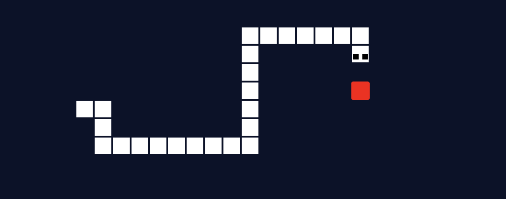
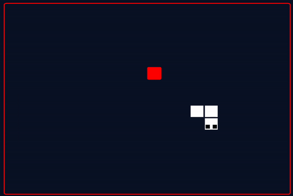
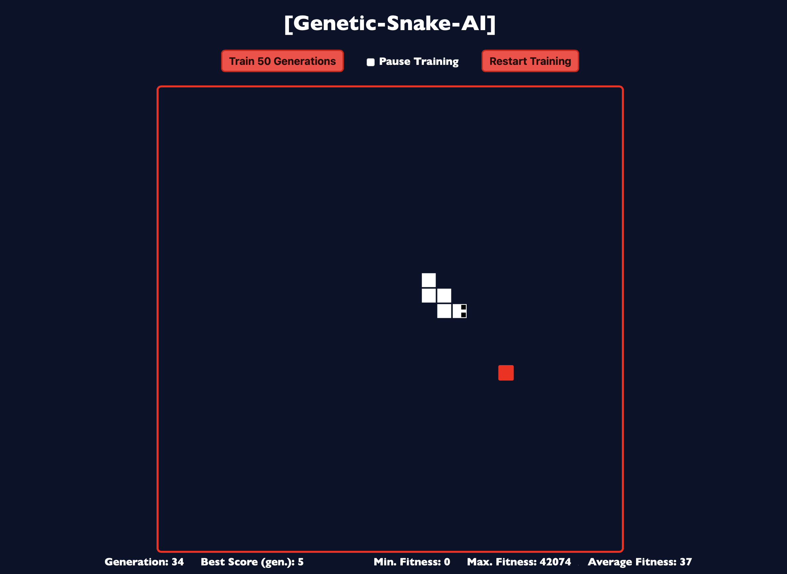

# Genetic-Snake-AI
An Artificial Intelligence to play the game Snake, using a Genetic Algorithm.



## About
The goal is to build a simple Snake game, and to create an artificial intelligence to play the game, and hopefully get high enough scores.



## Motivation
This project is a sequel to both [MLP-Digits-Recognition](https://github.com/Red-Rapious/MLP-Digits-Recognition) and [Genetic-Birds-Simulator](https://github.com/Red-Rapious/Genetic-Birds-Simulator). I decided to apply the genetic algorithm approach to a situation more complicated than the last time, the game of [Snake](https://en.wikipedia.org/wiki/Snake_(video_game_genre)).

## How it works
### The Brain
Each snake is given an artificial brain, represented by a Feed-Forward Neural Network. By default, the networks contains `8x3 = 24` input neurons, two intermediate layers of `18` neurons, and an output layer of `4` neurons.

The highest activation of the output layer decides the direction of the snake for the next move.

### The Eyes
The snake can see in 8 directions (including diagonals). For each direction, the snake is given 3 pieces of information:
- The distance to the apple
- The distance to the wall
- The distance to its tail

The greater the distance, the less the corresponding neuron is activated.

### The Genetic Algorithm
By default, each generation is made of 2000 snakes playing simultaneously. Once every single game is lost, the fitness of each snake is computed, increasing with the snake's lifetime, and the number of apples it has eaten. 

Then, the next generation is created using three steps:
- **Selection:** two parents are selected using Roulette Wheel Selection, meaning that the higher the fitness, the more chances a snake has to be selected.
- **Crossover:** the two parent's brain are fused to create the child's brain. I used to use Uniform Crossover, but instead changed for 1-Point Crossover to improve the training process.
- **Mutation:** noise is added to the weights and biases of the child's brain, using Gaussian Mutation.

On top of that, the best `n` snakes of each generations are saved and added to the next generation without alteration.

## Results
Using the defaults parameters, snakes tend to avoid walls after the 10th generation. Some snakes try to maximise their fitness function through lifetime by moving in circle, but are outperformed by the apple-seeking snakes after the 30th generation or so.

The best snakes of the 50th generations directly move towards apple, and manage to get scores between 15 and 20 in the given 500 maximum moves.

## Workspace description
- The [`lib-neural-network`](libs/neural-network/src/lib.rs) library contains an implementation of a FFNN (Feed-Forward Neural Network). Conversely to my last two projects, I had performance in mind and used the [`nalgebra`](https://www.nalgebra.org) crate to optimise the computations of the Neural Network.
- The [`lib-genetic-algorithm`](libs/genetic-algorithm/src/lib.rs) library implements a genetic algorithm, which selects, crossovers, and mutates individuals.
- The [`lib-game`](libs/simulation/src/lib.rs) back-end library holds snakes, apples, and is responsible for game update and evolution.
- The [`lib-game-wasm`](libs/simulation-wasm/src/lib.rs) middle-end library is a WebAssembly wrapper for `lib-game`.
- The [`npm` app](www) contains the front-end elements for the simulation and is responsible of displaying snakes, apples, and to handle user input.

## Installation

The game and AI can run in any browser. To try it yourself, you will need:
- `rustc` and `cargo` installed, for the back-end code.
- [`wasm-pack`](https://rustwasm.github.io/wasm-pack/installer/), to compile Rust code into WebAssembly
- [`npm`](https://www.npmjs.com/get-npm) for the front-end simulation

> __Note:__ some packages used seem to conflict with latest `npm` versions. If you encounter any issues, try to change `npm` version using `npm install npm@9.5.0 -g`, and to add the following node option: `export NODE_OPTIONS=--openssl-legacy-provider`.

In the `Genetic-Snake-AI` root folder, start by compiling the Rust code to WebAssembly by running:
```console
$ cd libs/game-wasm
$ wasm-pack build --release
```

Then, launch the front-end game by running:
```console
$ cd ../..
$ cd www
$ npm run start
```

If everything goes as planned, your terminal will display:
```console
...
｢wds｣: Project is running at http://localhost:8080/
...
｢wdm｣: Compiled successfully.
```

Enter `http://localhost:8080/` (or any other given address) in your favorite web browser, and the simulation should start.



## Parameters
You can play with the parameters of the game and genetic algorithm. They are defined as constants in the following files:

[`game/lib.rs`:](libs/game/src/libs.rs)
- Gaussian mutation parameters: the chance of mutation, and coefficient of change.
- The `MAX_AGE`, maximum number of steps between two evolutions.

[`index.js`:](www/index.js)
- `FRAME_DELAY`, the minimum delay between each frame, in milliseconds. Use this to ajust the speed of the game. Values around `50` are close to the normal speed of the actual game, but small values increase the speed of the training process.
- `GENERATIONS_TRAIN`, the number of generations trained by one click of the "Next Generation" button.

[`neural-network/lib.rs`:](libs/neural-network/src/lib.rs)
- `ACTIVATION_FUNCTION`, the activation function used by the neural network, can be chosen between `Sigmoid` or `ReLU`.
- `LAYERS`, the layers of the neural network. Note that the input and output layers should not be changed, only the intermediate layers.

<!--[`game/snake.rs`:](libs/game/src/snake.rs)
- `APPLE_COEFF`, the weight of apples compared to age in the definition of the fitness function.
- `AGE_COEFF`, idem with age compared to apples.
> Note: you can even play with the mathematical formula to compute the fitness function, defined towards the end of [`snake.rs`](libs/game/src/snake.rs).-->

[`game-wasm/libs.rs`](libs/game-wasm/src/lib.rs)
- The number of snakes trained at the same time.
- The width and height of the grid in which the snakes are trained.

Do not forget to `wasm-pack build --release` after changing parameters, outside of the `index.js` file.

## License
This work is licensed under the [CC-BY-NC-SA 4.0](https://creativecommons.org/licenses/by-nc-sa/4.0/) license.